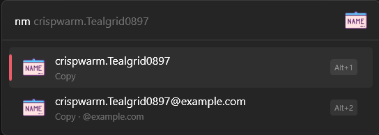
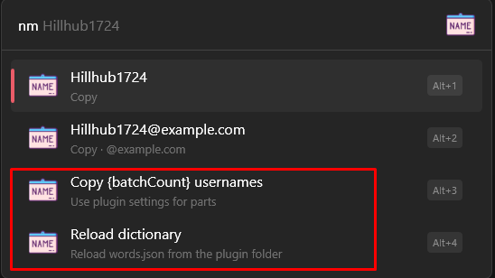
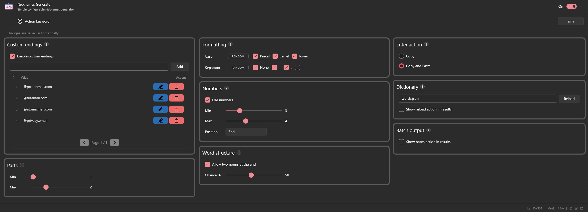
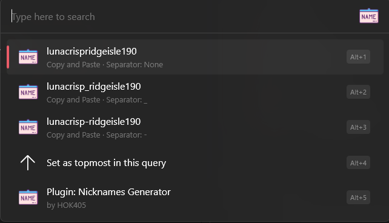
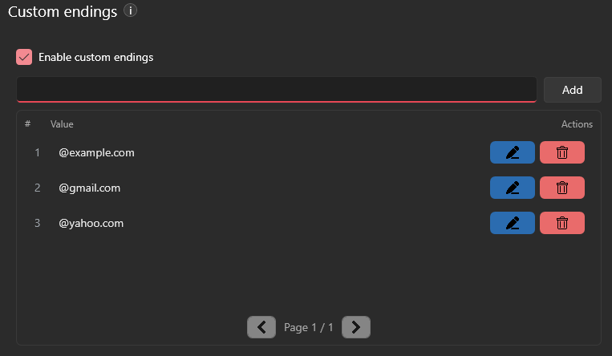
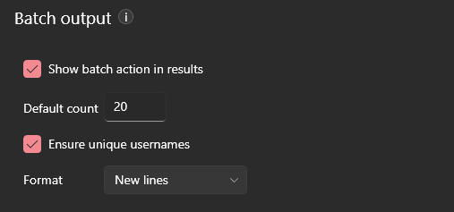

# Nicknames Generator (Flow Launcher Plugin)

Generate catchy, configurable nicknames / usernames right from Flow Launcher — with optional suffixes (custom endings), numbers, formatting rules, and batch output.

> Settings are saved automatically.

## Screenshots

**Plugin in action**

**Actions / batch example**

**Settings**

**Context Menu Example**

---

## Features

- **Word-based nickname generation** using a configurable dictionary file.
- **Custom endings (suffixes)** — e.g. `@gmail.com`, `_dev`, `.eth`  
  You can still pick the “plain” nickname without an ending.
- **Configurable word parts count** — fixed or range (Min/Max).
- **Formatting controls**
  - Case: `Pascal`, `camel`, `lower`
  - Separator: `None`, `_`, `.`, `-`
  - If you choose **one** option → **FIXED**
  - If you choose **multiple** options → **RANDOM**
- **Numbers**
  - Enable/disable
  - Digits count range (Min/Max)
  - Position: **Front**, **End**, **Both**
- **Word structure**
  - Optional “two nouns at the end”
  - Configurable chance in %
- **Enter behavior**
  - **Copy** result
  - **Copy and Paste** (copies and then pastes via `Ctrl+V`)
- **Batch output**
  - Optional action to generate many results at once
  - Default count (clamped to a safe range)
  - Optional uniqueness enforcement
  - Output format: **New lines** or **Comma + space**
- **Reload dictionary**
  - Reloads the configured words file from the plugin folder
  - Optional “show reload action in results”
- **Context Menu** (New Feature)
  - After generating a nickname, use the **Right Arrow** key to open the **context menu** and view additional variations of the generated nickname.
  - The menu includes all possible separators (`None`, `_`, `.`, `-`), even if they were not selected during the initial random generation.
  - This allows you to quickly switch between different separator options without needing to regenerate the nickname.

---

## Usage

1. Open **Flow Launcher**.
2. Run the plugin using its **Action Keyword** (set in Flow Launcher plugin settings).
3. Pick a generated nickname from the results:
   - Press **Enter** to copy (or copy+paste, depending on your settings).
   - Use **Right Arrow** to open the **context menu** and view alternative separator variations for your selected nickname.

> Tip: Enable **Batch output** to generate multiple nicknames in one go.

---

## Settings Guide

### Custom endings
Optional suffixes appended to generated nicknames (for example: `@example.com`).

- Toggle **Enable custom endings**
- Add a new ending via the input + **Add**
- Edit/Delete endings from the list
- Endings are treated as **case-insensitive** (duplicates are ignored)

### Parts
Controls how many “word parts” are used:

- If **Min = Max** → fixed parts count
- Otherwise → range mode

### Formatting
Controls casing and separators. The UI shows the current mode:

- **FIXED** if only one option is selected
- **RANDOM** if multiple options are selected

### Numbers
Adds digits to the nickname:

- Enable **Use numbers**
- Set **Min/Max** digits
- Choose **Position**: Front / End / Both

### Word structure
- **Allow two nouns at the end**
- **Chance %** controls how often this happens

### Enter action
Choose what happens when pressing Enter on a result:

- **Copy**
- **Copy and Paste** (uses `Ctrl+V`)

### Dictionary
- **Words file**: the dictionary file name (default: `words.json`)
- **Reload**: re-reads the file from the plugin folder
- Optionally show a **Reload action** in results

### Batch output
Adds an optional action for generating multiple nicknames at once:

- Default count
- Ensure unique nicknames
- Output format: New lines / Comma + space

### Context Menu
- After selecting a generated nickname, you can press **Right Arrow** to open the **context menu**.
- The context menu will display alternative variations of the generated nickname with different separators (e.g., `_`, `.`, `-`).
- This allows you to easily select from different styles of separators without regenerating the nickname.

---

## Notes

- Changes are **saved automatically** (there is no “Save” button).
- The settings UI is responsive and may switch between two/three columns depending on available width.
